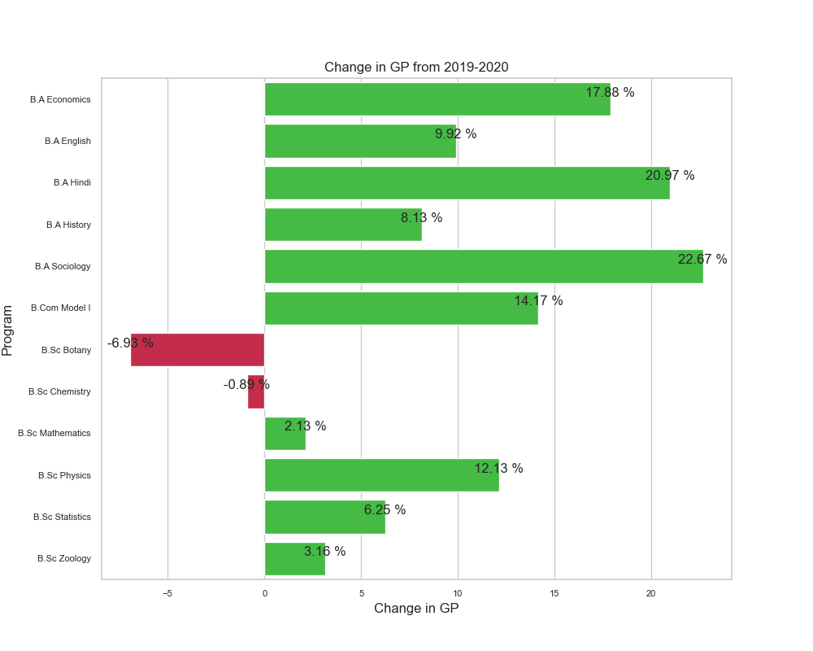
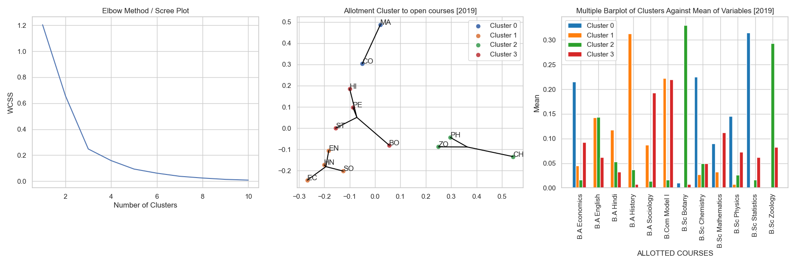
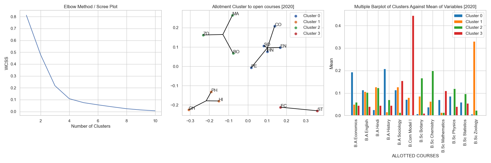

# Open-Course-Elective-Choice-Trends-of-Students [2019-2020]
***Data Source*** : Department of Statistics, [Mar Athanasius College of Arts and Science (Autonomous), Kothamangalam](https://macollege.in)    
***Language*** : Python   
***Workflow*** : JupyterLab, Microsoft Excel

 **Certain columns with [Personally Identifiable Information [PII]](https://www.ibm.com/topics/pii "See Meaning💡") have been removed for privacy reasons.*
 
## TABLE OF CONTENTS : 📌
1. [Project Background](#1-project-background) 
2. [About the Data](#2-about-the-data) 
3. [Project Summary](#3-project-summary) 
4. [Exploratory Data Analysis [EDA]](#4-exploratory-data-analysis-eda)
5. [K-Means Clustering](#5-k-means-clustering)
6. [Multinomial Logistic Regression](#6-multinomial-logistic-regression)

### **1. PROJECT BACKGROUND** ❓

In the fifth semester, students across 12 departments gets to enroll in a course, out of 13 options. The students are mandated to fill in a form. The form requires students to fill in their informations such as gross points from the first two semesters, choice fillings from first to sixth along with their unique id and parent department information. The students will be elected based on the priority of choices and gross percentage scores.

***
### **2. ABOUT THE DATA** 🧩

The data was collected by the Department of Statistics. The mode of collection of data was facilitated by using [Google Forms](https://docs.google.com/forms/u/0/ "See Online💡") which the students had to fill in. Data from the year 2019 & 2020 were used conveniently for comparison purposes. The data collected was then made to undergo a few transformations and some basic cleaning in [Microsoft Excel](https://www.microsoft.com/en-us/microsoft-365/excel "See Online💡").

#### **2.1. Data Files :**
1. **[Allotment-Data-2019.xlsx](Data/Allotment-Data-2019.xlsx "Download⬇️")**      
2. **[Allotment-Data-2020.xlsx](Data/Allotment-Data-2020.xlsx "Download⬇️")**

#### **2.2. Data Info :**

|     | Rows | Columns |
|-----|------|---------|
|2019 | 368  |  10     |
|2020 | 413  |  12     |

#### **2.3. Columns :**

  - **Program** : The name of the "parent department" where students are from.
  - **ID** : The unique ID of the students.
  - **gp** : Gross Percentage score of students, it is calculated by taking the average scores of first two semesters.
  
 $$
gp = \frac{Sem \space I \space Score + Sem \space II \space Score}{Total \space Marks}
$$

    
  - **FC**  : First choice
  - **SC** : Second choice
  - **TC** : Third Choice
  - **FOC** : Fourth Choice
  - **FIC** : Fifth Choice
  - **SIC** : Sixth Choice
  - **Allotted Course** : The allotted course of the student.

#### **2.4. Departments :**

  1. *B.Com. Model I*
  2. *B.A. Economics*
  3. *B.A. Sociology*
  4. *B.A. English*
  5. *B.A. History*
  6. *Physical Education*
  7. *B.Sc. Chemistry*
  8. *B.Sc. Mathematics*
  9. *B.Sc. Statistics*
  10. *B.Sc. Zoology*
  11. *B.Sc. Botany*
  12. *B.Sc. Physics*
  13. *B.A. Hindi*
  
#### **2.5. Notations of Course Choices :**
  
  - **CO** : Course of **Commerce**
  - **EC** : Course of **Economics**
  - **SO** : Course of **Sociology**
  - **EN** : Course of **English**
  - **HI** : Course of **History**
  - **PE** : Course of **Physical Education**
  - **CH** : Course of **Chemistry**
  - **MA** : Course of **Mathematics**
  - **ST** : Course of **Statistics**
  - **ZO** : Course of **Zoology**
  - **BO** : Course of **Botany**
  - **PH** : Course of **Physics**
  - **HN** : Course of **Hindi**

***
### **3. PROJECT SUMMARY** 🏆
  1. Nearly 75% to 80% of students got their first choice as their allotted department.
  2. There was a general increase in the average gp of the entire college from 2019 to 2020.
  3. **B.Sc. Botany** and **B.Sc. Chemistry** were the only two programs that had a decrease in average GP scores.
  4. Science subjects had a higher GP scores than arts subjects.
  5. **B.Sc. Mathematics** has the highest sverage gp scores in both years.
  6. There were six students in the year 2020 who were admitted to a course outside of their choice.
  7. Science students have better chances of being admitted to the course of their choice compared to arts students.
  8. Even though science departments had the highest marks in both years, the highest improvement in GP scores were observed in the art departments.

***

### **4. EXPLORATORY DATA ANALYSIS [EDA]** 💡

EDA is a very important step in a any data analysis project.

#### 4.1. Gross Percentage Descriptive Stats


| Department      |  Avg. GP 2019 | Avg. GP 2020 |  Change +/- |
|-----------------|------------|--------|---------|
| B.A Economics   |  47.69     | 56.23  | &#9650; | 
| B.A English     |  58.43     | 64.23  | &#9650; | 
| B.A Hindi       |  45.50     | 55.03  | &#9650; | 
| B.A History     |  46.51     | 50.29  | &#9650; | 
| B.A Sociology   |  43.22     | 53.01  | &#9650; | 
| B.Com Model I   |  65.70     | 75.01  | &#9650; | 
| B.Sc Botany     |  68.83     | 64.07  |🔻      | 
| B.Sc Chemistry  |  76.37     | 75.69  |🔻      |
| B.Sc Mathematics|  76.67     | 78.30  | &#9650; |
| B.Sc Physics    |  67.98     | 76.24  | &#9650; |
| B.Sc Statistics |  71.97     | 76.46  | &#9650; |
| B.Sc Zoology    |  61.14     | 63.06  | &#9650; |

*Table 1.0.  shows the department wise average Gross Percentage of students and the change from years 2019 and 2020.*
From the above Table we can observe the following:
1. The departments **B.Sc. Botany** and **B.Sc. Chemistry** were the only two departments to have a decrease in the average gp score.
2. Science departments have higher average scores than most arts courses.

***


##### 4.1.1. GP Descriptive Stats 2019

| Department       | count  | mean	| std	| min	|  25%	| 50%   | 75%	| max   |
|------------------|--------|-------|-------|-------|-------|-------|-------|-------|
| B.A Economics	   | 35.0	| 47.70	| 22.44 | 0.00  | 32.82	| 44.10 | 70.30 | 76.90 |
| B.A English	   | 35.0	| 58.44	| 20.54	| 10.60 | 37.90 | 63.80	| 75.60	| 87.40 |
| B.A Hindi	       | 22.0	| 45.50	| 23.93	| 7.00	| 26.10 | 47.00	| 62.67	| 84.17 |
| B.A History	   | 36.0	| 46.51	| 17.07 | 13.40	| 32.98	| 49.20	| 55.98	| 87.20 |
| B.A Sociology    | 33.0	| 43.22	| 21.45 | 5.00  | 29.00	| 44.60	| 59.00	| 87.70 |
| B.Com Model I	   | 50.0	| 65.70	| 16.78	| 23.00 | 60.04	| 71.71	| 76.98	| 88.58 |
| B.Sc Botany	   | 28.0	| 68.84	| 13.90 | 31.17	| 64.19	| 71.21	| 79.62	| 85.42 |
| B.Sc Chemistry   | 24.0	| 76.37	| 15.43 | 34.83	| 67.33	| 82.46	| 87.77 | 92.25 |
| B.Sc Mathematics | 25.0	| 76.67	| 12.67 | 36.24	| 70.48	| 76.50	| 87.17	| 91.92 |
| B.Sc Physics	   | 23.0	| 67.99	| 18.20	| 29.17	| 56.88	| 75.08	| 79.79 | 89.75 |
| B.Sc Statistics  | 29.0	| 71.97	| 10.47	| 47.67	| 65.58	| 74.08	| 78.08 | 88.67 |
| B.Sc Zoology	   | 28.0	| 61.14	| 16.95	| 24.17	| 52.63	| 65.09	| 74.17	| 88.50 |

*Table 1.1.  shows the department wise descriptive statistics of Gross Percentage in the year 2019.*

***
##### 4.1.2. GP Descriptive Stats 2020

|Department        | count	| mean|	std	    |  min	| 25%	|  50%	|  75%  |   max|
|------------------|--------|-----|---------|-------|-------|-------|-------|------|
|B.A Economics	   | 49.0	|56.23|	22.00   |8.70	|38.20	|58.80	|74.90  |87.20|
|B.A English	   | 40.0	|64.24|	16.89	|30.50	|48.00	|68.20	|79.80	|88.70|
|B.A Hindi	       | 29.0	|55.04| 22.11	|16.33	|35.50	|48.33	|76.17	|90.83|
|B.A History	   | 42.0	|50.29|	22.92	|0.00	|36.65	|54.25	|66.55	|89.50|
|B.A Sociology	   | 43.0	|53.02|	15.75   |15.60	|43.95	|55.90	|62.45	|81.70|
|B.Com Model I     | 51.0	|75.01|	16.00	|27.67	|67.96	|79.58	|87.21	|93.33|
|B.Sc Botany	   | 23.0	|64.07|	22.31	|15.50	|54.92	|73.92	|78.46	|87.08|
|B.Sc Chemistry	   | 26.0	|75.69|	16.32	|37.00	|71.19	|82.87	|86.73	|92.83|
|B.Sc Mathematics  | 25.0	|78.30|	12.02	|50.58	|75.67	|81.33	|86.50	|90.67|
|B.Sc Physics	   | 29.0	|76.24|	12.36	|38.58	|69.33	|80.25	|85.25	|93.17|
|B.Sc Statistics   | 27.0	|76.47|	16.57	|29.25	|71.58	|81.58	|88.88	|92.25|
|B.Sc Zoology	   | 29.0	|63.07|	16.63	|28.92	|50.33	|65.92	|78.42	|89.08|

*Table 1.2.  shows the department wise descriptive statistics of Gross Percentage in the year 2020.*

***

##### 5.0. A Rather Miss-Happenning in 2020

|   ID    |    Program   |      gp   |
|---------|--------------|-----------|
|   1020  | B.A Economics|  67.700000|
|   1038  | B.A Economics|  65.100000|
|   1066  |  B.A English |  30.500000|
|   1099  |    B.A Hindi |  43.666667|
|  1109   |   B.A Hindi  |  18.500000|
|  1133   |  B.A History |  47.900000|

*Table 1.3. showing the students who were not admitted to any of their 6 choice preferences.*

***

|    Department   | Top Allotted [2019] | Top Choice [2019] | Top Allotted [2020] | Top Choice [2020] |
|-----------------|-----|----|----|----|
| B.A Economics   |  CO | ST | CO | CO | 
| B.A English     |  SO | SO | SO | PE |
| B.A Hindi       |  EN | SO | BO | HI |
| B.A History     |  EC | EC | EN | SO |
| B.A Sociology   |  HI | HI | EC | HI |
| B.Com Model I   |  ST | ST | ST | ST |
| B.Sc Botany     |  CH | CH | ZO | ZO |
| B.Sc Chemistry  |  MA | MA | MA | MA |
| B.Sc Mathematics|  ST | ST | CO | CO |
| B.Sc Physics    |  CO | CO | MA | MA |
| B.Sc Statistics |  MA | MA | CO | CO |
| B.Sc Zoology    |  CH | CH | CH | CH |

*Table 2.0.  Table depicting the Top Choice and the Top Allotted Course of each parent department on both years.* 
- The science departments have been mostly admitted to the course of their choice.
- For students in the art departments, it is less likely that they get elected to the course of their choice.

***


### **Distribution of Students in Parent Departments [2019-2020]**
     
*fig 1.0. showing the proportion and count of students in various departments.*

- The department with the most students are in **B. Com Model I** on both 2019 and 2020.
- The department with the least students is **B.A. Hindi** in 2019 and **B.Sc. Botany** in 2020.

***

### **Average Department-Wise GP [2019-2020]**

*fig 2.0. shows the department-wise average GP scores of students.*
- In the year 2019, **B.Sc. Mathematics** had the highest average GP scores followed by **B.Sc. Chemistry** and **B.Sc. Statistics**, while the least GP scores obtained was by **B.A. Sociology**.
- In 2020, **B.Sc. Mathematics** had the highest GP closely followed by **B.Sc. Statistics** and **B.Sc. Chemistry**.

***

### **Change in GP Score from (2019 - 2020)**
  
  *fig 2.1. showing the change in the average GP score of departments as observed from 2019 to 2020.*
  - The arts subjects namely **B.A. Sociology** (+23%), **B.A. Hindi** (+21%) and **B.A. Economics** (+18%) had a great deal of improvement.
  - While most departments saw an increase in the GP scores, the Departments **B.Sc. Botany** had a significant fall of nearly (-7%) followed by **B.Sc. Chemistry** (-1%).

***


### **Boxplots - GP Scores (2019-2020)**

*fig. 2.2. shows the boxplots of GP scores in both years*
- It can be observed that, even though there have been a general increase in the average GP scores of departments, [outliers](https://mathworld.wolfram.com/Outlier.html "See Definition!💡") have also had a significant increase in the year 2020 as compared to 2019.
- It is found out that most Science departments had outliers.

***


### **Lineplot of GP Scores (2019-2020)**

*fig. 2.3. shows the line plot of departments*
- The general increase in GP score trend as verified from the other plots have also been observed here.

***


### **Probability Distribution Plot - GP Scores (2019-2020)**

*fig. 2.4. shows the layered [probability density plot](https://www.khanacademy.org/math/statistics-probability/random-variables-stats-library/random-variables-continuous/v/probability-density-functions "See Definition!💡") of GP scores in both years*
- There is a general trend pointing that there has been an increase in the GP scores of departments.
- There have been an increase in GP scores.

***


### **Top Popular Open Course Subjects (2019-2020)**

  
*fig 3.0. showing the Total Count of Top 3 Choices received to each Open Course Subjects.*
- On both years, It is evident that the open course subject of **Sociology** had the most demand followed by **Economics**.
- While **Hindi** had received the least of interest from the students.

***


### **Top Choice Allotted Proportion (2019-2020)**


*fig 4.0. shows the proportion of students being allotted to the first choice*
- We can observe that on both years, nearly 80% of students were usually admitted to the first choice that they preferred.

***

### **Heatmap - Allotment Proportion of Parent Departments (2019-2020)**


*fig 5.0. Heatmap showing the proportion of students from parent department to the allotted open course subjects*
- The above [heatmap](https://www.hotjar.com/heatmaps/ "See Online💡") depicts a general trend where students in the art departments are allotted to another art departments and vice-versa for science departments.
- There were less consolidation of students in 2020 as compared to that in the year 2019, As a result we are able to observe that students have been distributed ti different courses.

***

### **Heatmap - Change in Allotment Proportion of Parent Departments (2019-2020)**


*fig 5.1. Heatmap showing the proportion of students from parent department to the allotted open course subjects*
- There was a significant increase in the students being admitted from **B.Sc. Mathematics** to **Commerce**, **B.Sc. Physics** to **Sociology** and to **Mathematics**.
- There was a significant decrease in the students being admitted from **B.Sc. Physics** to **Commerce**, **B.Sc. Botany** to **B.Sc. Chemistry. [See Fig 5.1 for more]

***

### **Top Parent Department Allotments (2019-2020)**

*fig 5.2. [Network Diagram](https://acqnotes.com/acqnote/tasks/network-diagram "See Online💡") showing the top course allotted by each parent department*
- In the year 2019, **Statistics**, **Mathematics**, **Commerce** and **Chemistry** had students allotted from more than one departments.
- In the year 2020, due to less consolidation only two courses had students being allotted from parent departments. As a result **Commerce** and **Mathematics** are the subjects with more than one departments.

***

### **Heatmap - Allotment Proportion in Open Course Subjects (2019-2020)**

- The general trend observed is similar to that from *[fig 5.0](#heatmap---Allotment-proportion-of-parent-departments-2019-2020)* where students in arts subjects are mostly from art departments and vice-versa for science open course subjects.
- **Economics** and **English** subjects had a healthy mix of students from multiple departments in both years.
- **B.Sc Zoology** students have a significant proportion in Chemistry open courses in both years. Likewise, **B.Com Model I** students also has a great presence in **Statistics**.
- **B.A. History** students have a notable presence in **Hindi** open courses in 2019 but not in 2020.

***

### **Heatmap - Change in Allotment Proportion in Open Course Subjects (2019-2020)**


*fig 5.3. shows the change in allotment proportion trends in the open course subjects*
- There was a steady increase in the **B.A. Economics** students being present in the **English** course (+31%) and **B.A. Hindi** students in **Botony** (+23%).
- **Economics** saw a decrease in the students coming from **B.A. History**.

***

### **Top Open Course Allotments (2019-2020)**

*fig. 5.4. shows the top parent program received in the open course subjects*
- Arts subjects contributed more to certain departments while the science students were spread equally across departments.
- In 2019, **B.A. History**, **B.A. Sociology**, **B.Com. Model I**, **B.Sc. Botany** contributed to multiple departments.
- In 2020, similarly **B.A. History** ,**B.A. Sociology**, **B.Com. Model I** and **B.A. Economics** contributed more to various departments.

***

### **Heatmap - First Choice (2019-2020)**

*fig. 5.5. shows the first choice proportion of students*
- Yearly Consistency: The pattern of preference remains relatively consistent between 2019 and 2020.
- On both years B.Sc. Zoology** students preferred **Chemistry**, similarly similar interest were also observed from **B.Sc. Chemistry** to **Mathematics** and from **B.Com Model I** to **Statistics**

***

### **Heatmap - Change in First Choice (2019-2020)**

*fig. 5.6 shows the change in first choice proportions of students*
- An increase in the interest of (+32%) from **B.Sc. Mathematics** to **Commerce** was observed. A similar interest was also observed from **B.Sc. History** to **Physical Education**.
- A significant decrease of (-55%) was observed from **B.Sc. Botany** to **Chemistry**.

***
### **Top Choices (2019-2020)**

*fig. 5.7. showing the network diagram representing the top elective course prefered by departmeants*
- In 2019, **Mathematics** and **Physical Education** was the top choices of students in nearly 3 parent departments.
- In 2020 however **Commerce** was the only subject to have had the top choices of students. **Mathematics** and **History** were other course receiving high demands of choices.
- On both years **Physics**, **Hindi**, **English** and **Hindi** were courses with little to no choice applications. 

***

### **5. K-Means Clustering** 💭

[K-Means Clustering](https://www.javatpoint.com/k-means-clustering-algorithm-in-machine-learning "See Online💡") is a simple but effective unsupervised learning algorithm used to group data points into clusters. It is a centroid-based algorithm, meaning it identifies groups (clusters) by finding the centroids (centers) of the data points. It uses the [Euclidean Distance](https://www.britannica.com/science/Euclidean-distance "See definition💡") to cluster the points with the lowest distance.

#### **Steps in K-Means Clustering :**
1.  **Define the number of clusters** (k) :
This is the most crucial step, as it determines the granularity of the clusters. The optimal number of clusters can be determined using various techniques, such as the [elbow method](https://www.geeksforgeeks.org/elbow-method-for-optimal-value-of-k-in-kmeans/ "See Definintion 💡") or [silhouette analysis](https://www.geeksforgeeks.org/silhouette-algorithm-to-determine-the-optimal-value-of-k/?ref=ml_lbp "See Online 💡"). For this project I have used elbow method to find the optimal no. of clusters.

2. **Initialize the centroids** :
The algorithm starts by randomly placing k centroids within the data space. These centroids represent the center of each cluster.

3. **Assign data points to clusters** :
Each data point is assigned to the closest centroid based on a distance metric, such as Euclidean distance.

4. **Recalculate the centroids** :
After all data points are assigned, the algorithm recalculates the centroids by taking the average of all data points within each cluster.

5. **Repeat steps 3 and 4 until convergence** :
The algorithm iterates between steps 3 and 4 until the centroids no longer move significantly. This indicates that the clusters have converged and are stable.

***

### **Allotment Clusters of Parent Department (2019)**

*fig 6.0 a. : uses the elbow method to find the optimal no. of clusters (here 3).*   

- The no. of cluster count taken here is 3 (as there was a steep elbow like structure observed at the x-axis at 3)

*fig 6.0 b. : Shows the cluster plot of parent departments visualized using [PCA](https://www.ncbi.nlm.nih.gov/pmc/articles/PMC4792409/ "See Definition! 💡") using a custom plot* 

- The cluster plot [fig 6.0b.] has been visualized using [Principle Component Axis (PCA)](https://www.ncbi.nlm.nih.gov/pmc/articles/PMC4792409/ "See Definition!💡") as there were more than 2 features used in clustering of the above plot.
- PCA is a dimensionality reduction technique.
- I used a custom plot similar to [fviz_cluster](https://www.rdocumentation.org/packages/factoextra/versions/1.0.7/topics/fviz_cluster "See Reference!💡") in R Programming to obtain similar result.

*fig 6.0 c. : shows the average mean of each clusters against their behaviours in the respective open course subjects*

- This plot shows the behaviour of the parent department clusters on the allotted open course subjects.

#### **Insights :**
- The clusters indicate similar allotment behaviours in science and art departments, this made the science departments to cluster together and the art departments to cluster together as well.
- The clusters in fig 6.0 b. validates the statement that the science students were usually admitted to other science departments and likewise for art departments. This is explained when comparing it with fig 6.0c. showing the average effect of the course allotment behaviours towards the open course subjects.
- The <span style="color: orange;">**cluster 1 [Orange]**</span> containing **B.Sc. Botany** and **B.Sc. Zoology** were clustered together because of the reason that they both had been collectively admitted to courses such as **Chemistry**, **Physics** and **Zoology**. [See fig 6.0 c.].
- Similarly <span style="color: dodgerblue;">**cluster 0 [Blue]**</span> and <span style="color: green;">**cluster 2 [Green]**</span> exhibitted similar behaviours to have been clustered together.

***

### **Allotment Clusters of Parent Department (2020)**

*fig 6.1a, b & c showing the elbow method, cluster plot and the multiple bar plot of parent departmet allotment behaviours*

#### **Insights :**

- Students in the art departments have been more spread into various departments than the science as the science students were mostly admitted to other science courses.
- The optimal cluster size here is 3 as from the first figure.
- As compared to the previous parent department clusters, the distance between the departments seems to be spread apart, indicating there have been a great deal of change in the allotment behaviours of parent departments in the year 2020.
- The <span style="color: green;">**cluster 2 [Green]**</span> containing math based departments have been clustered because they were allotted primarily to **Commerce**.
- The <span style="color: orange;">**cluster 1 [Orange]**</span> containing science departments of **B.Sc. Botany**, **B.Sc. Chemistry** and **B.Sc. Physics** have been clustered together because they have been mostly allotted to **Mathematics** and **Zoology**. 
- The <span style="color: dodgerblue;">**cluster 0 [Blue]**</span> seem to consist mostly of art departments, these were clustered together because they were spread across different departments in a similar way. 

***

### **Allotment Clusters of Open Course Subjects (2019)**

*fig 6.2 a, b & c showing the allotment behaviours experienced by the open course subjects in the year 2019*

#### **Insights :**

- Even through the suggested cluster size here is 3 as observed from the scree plot, we have opted to use 4 clusters because 4 clusters represents the subject clusters better.
- <span style="color: dodgerblue;">**Cluster 0 [Blue]**</span> contains the subjects namely **Commerce** and **Mathematics**. The clustering of these departments can be explained by the collective allocation of students from **B.Sc. Statistics**, **B.A. Economics** and **B.Sc. Chemistry**.
- <span style="color: orange;">**Cluster 1 [Orange]**</span> has been clustered together because of the reason that students from the **B.A. History** department had been allocated to these courses, followed by the students from **B.Com Model I** and **B.A. English**.
- <span style="color: green;">**Cluster 2 [Green]**</span> having the subjects **Zoology**, **Physics** and **Chemistry** had been clustered since these courses saw a great deal of students from Biology based departments such as **B.Sc. Botany** and **B.Sc. Zoology**.
- <span style="color: indianred;">**Cluster 3 [Red]**</span> had a mix of varied course subjects such as **Statistics**, **Physical Education**, **History** and **Botany**. These were grouped together because these subjects had most students from **B.Com Model I**,  **B.A. Sociology** and a few other departments from both the science and arts domains.

***

### **Allotment Clusters of Open Course Subjects (2020)**

*fig 6.3 a, b & c showing the allotment behaviours experienced by the open course subject in the year 2020*

#### **Insights :**

- The optimal no. of clusters were found to be 4 from the scree plot.
- The clusters has had a great deal of difference in the allotment behaviours when compared with that of 2019.
- <span style="color: dodgerblue;">**Cluster 0 [Blue]**</span> contains a mix of mostly art departments clustered as a result of the consolidated students being allotted from other art deprtments from the same domain as from the cluster.
- <span style="color: orange;">**Cluster 1 [Orange]**</span> were of the subjects **Chemistry**, **Physics** and **History** these were clustered since most students in these courses were from **B.Sc. Zoology** followed by a few other art departments.
- <span style="color: green;">**Cluster 2 [Green]**</span> had subjects such as **Zoology**, **Mathematics** and **Botany**. These were clustered for a few reasons.
   - Students from **B.Sc. Chemistry** were a common factor being alloted to these departments.
   - These courses saw the immigration of students from other departments in the parent department in the same cluster. Eg: students from **B.Sc. Botany** had a good presence in the **Zoology** course, vice-versa for **BSc. Zoology** and **B.Sc. Chemistry** departments.
- <span style="color: indianred;">**Cluster 3 [Red]**</span> being **Economics** and **Statistics** subjects were clustered together as there was a strong allotment behaviour to these courses from **B.Com Model I** (See fig 6.3c.).

***

### **Parent Department Clusters of First Choice (2019)**

*fig 6.4 a, b & c showing the scree plot, cluster plot and the multiple barplot of cluster formation.*

#### **Insights :**

- The optimal cluster size is found out to be 3 from the scree plot in fig 6.4a.
- <span style="color: dodgerblue;">**Cluster 0 [Blue]**</span> mostly contains art departments with a few exceptions like **B.Sc. Physics**, **B.Sc. Mathematics** and **B.Com Model I**. Students in these departments had an similar interest in applying for courses such as **Statistics**, **Economics**, **Sociology** and a few other courses.
- <span style="color: orange;">**Cluster 1 [Orange]**</span> shows that students in the departments of **B.Sc. Statistics** and **B.Sc. Chemistry** had a significant similarity in the first choice interests. This can be explained due to their common interest towards the **Chemmistry** open course (See fig. 6.4c.).
- <span style="color: green;">**Cluster 2 [Green]**</span> being the departments of **B.Sc. Botany** and **B.Sc. Zoology** had a very similar first choice behaviour, This can be explained due to the common interest towards the **Chemistry** course.

***

### **Parent Department Clusters of First Choice (2020)**

*fig 6.5a, b & c showing the scree plot, cluster plot and the multiple barplot of cluster formation.*

#### **Insights :**
- The optimal cluster size is found out to be 3 from the scree plot in fig. 6.5a.
- There have been a significant change in the first choices of students in 2020 as compared to 2019. We are able to see a whole new set of clustered plots in the year 2020.
- The year 2020 had less to do with science students choosing other science courses and arts students choosing other art courses. This is rather a good thing to observe since the whole point of open course is to get to learn new things.
- <span style="color: dodgerblue;">**Cluster 0 [Blue]**</span> contains science departments but this time it is very spaced from each other. Students in these departments had a very strong interest towards the subject **Mathematics** which in-turn made them into a single cluster.
- <span style="color: orange;">**Cluster 1 [Orange]**</span> contains mostly art departments being clustered together for having a common interest for the open course subjects **Physical Education**, **History** and **Sociology**.
- <span style="color: green;">**Cluster 2 [Green]**</span> has managent related clusters of parent departments having a particular interest in the **Statistics** and **Commerce** open course subjects.


### **6. Multinomial Logistic Regression** 🎯

[Multinomial Logistic Regression](https://scikit-learn.org/stable/modules/generated/sklearn.linear_model.LogisticRegression.html "See Reference! 💡") is an extension of the binary logistic regression to handle multiple classes. It is a classification algorithm that is particularly useful when the target variable has more than two categories. Multinomial Logistic Regression extends logistic regression to predict outcomes with more than two categories. It models the probability of each category relative to one reference category.

#### Introduction
In this project, we employed a multinomial logistic regression model to predict the allotted courses for students based on their numerical and categorical attributes. We trained the model on the 2019 dataset and subsequently tested it on both the 2019 and 2020 datasets to evaluate its performance and generalizability.

#### Methodology
The dataset includes various features, with one numerical column and several categorical columns. The target variable is the 'Allotted Course'. The categorical features were one-hot encoded to convert them into a numerical format suitable for the logistic regression model.

#### Steps involved were: 
- Data Preparation: Splitting the dataset into features (X) and target (y).
- Encoding: One-hot encoding categorical variables.
- Model Training: Training a multinomial logistic regression model using the 2019 training data.
- Model Evaluation: Testing the model on the 2019 and 2020 test data and evaluating its performance.

#### Results and Interpretation

##### 2019 Results
###### Confusion Matrix:
The confusion matrix for the 2019 test data shows how well the model predicted each class. Each row represents the actual class, and each column represents the predicted class. Diagonal values indicate correct predictions, while off-diagonal values indicate misclassifications.

#### Classification Report:
The classification report provides precision, recall, and F1-score for each class:

- **Precision**: The ratio of correctly predicted positive observations to the total predicted positives.
- **Recall**: The ratio of correctly predicted positive observations to the all observations in the actual class.
- **F1-Score**: The weighted average of Precision and Recall.


#### **CODE :**
```python
from sklearn.model_selection import train_test_split
from sklearn.preprocessing import OneHotEncoder
from sklearn.linear_model import LogisticRegression
import sklearn.metrics as metrics
from joblib import dump,load

# Split into X and y
numerical_column = df1.iloc[:, 2]  # Select the numerical column
categorical_columns = df1.iloc[:, 3:9]  # Select the categorical columns

# Combine numerical and categorical columns
X = pd.concat([numerical_column, categorical_columns], axis=1)
y = df1['Allotted Course']

# One-hot encode the categorical variables
encoder = OneHotEncoder(handle_unknown='ignore', sparse_output=False)
X_encoded = pd.DataFrame(encoder.fit_transform(X))
X_encoded.columns = encoder.get_feature_names_out(X.columns)

# Split into train and test sets
X_train, X_test, y_train, y_test = train_test_split(X_encoded, y, test_size=0.2, random_state=42)

# Fit the model
model = LogisticRegression(multi_class='multinomial', solver='lbfgs')
model.fit(X_train, y_train)

# Save the trained model
dump(model, 'Model/MNLogReg.joblib')
```


Classification Report:

              precision    recall  f1-score   support

          BO       1.00      0.25      0.40         4
          CH       0.75      1.00      0.86         6
          CO       0.78      1.00      0.88         7
          EC       0.80      1.00      0.89         4
          EN       0.88      0.88      0.88         8
          HI       0.80      1.00      0.89         4
          HN       1.00      0.00      0.00         2
          MA       1.00      0.75      0.86         8
          ...
    weighted avg   0.86      0.82      0.80        74

#### Overall Metrics (2019):
- **Accuracy score** : 82.43 %
- **Log loss** : 75.74 %

### 2020 Results:

#### Confusion Matrix:

2020 Results:
Confusion Matrix:

Classification Report:

                precision    recall  f1-score   support

          BO       0.80      0.40      0.53        10
          CH       0.67      0.67      0.67         3
          CO       1.00      0.91      0.95        11
          EC       1.00      1.00      1.00         6
          EN       0.75      0.60      0.67         5
          HI       0.83      0.91      0.87        11
          HN       1.00      0.50      0.67         4
          MA       0.40      1.00      0.57         4
          ...
    weighted avg   0.81      0.75      0.74        83

#### Overall Matrix:
- **Accuracy score**: 74.7
- **Log loss**: 1.0062

#### Interpretation
- The model's accuracy on the 2020 dataset was approximately 74.7%, which is slightly lower than the 2019 accuracy.
- Similar to 2019, classes like 'CO' and 'EC' showed strong performance with high precision, recall, and F1-scores.
- Some classes like 'BO' had a noticeable drop in performance, with precision and recall indicating potential issues in correctly predicting these classes.
- The increase in log loss to 1.0062 suggests higher predictive uncertainty in the 2020 dataset compared to 2019.

#### Conclusion:
The multinomial logistic regression model demonstrated reasonable accuracy and performance in predicting course allotments for both 2019 and 2020 datasets. However, there are discrepancies in performance across different classes, with some classes consistently showing high predictive power and others indicating potential areas for model improvement. The results suggest that while the model generalizes well, there is room for refinement, particularly in addressing the variability and potential changes in the underlying data between years. 


